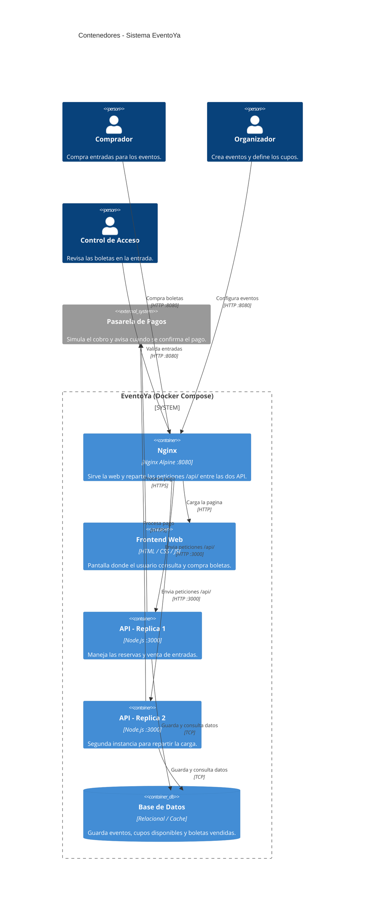

# Diagrama de Contenedores (C4 - Nivel 2)

```mermaid
C4Container
  title Contenedores - Sistema EventoYa

  Person(comprador, "Comprador", "Compra entradas para los eventos.")
  Person(organizador, "Organizador", "Crea eventos y define los cupos.")
  Person(acceso, "Control de Acceso", "Revisa las boletas en la entrada.")

  System_Boundary(eventoya, "EventoYa (Docker Compose)") {
    Container(nginx, "Nginx", "Nginx Alpine :8080", "Sirve la web y reparte las peticiones /api/ entre las dos API.")
    Container(frontend, "Frontend Web", "HTML / CSS / JS", "Pantalla donde el usuario consulta y compra boletas.")
    Container(api1, "API - Replica 1", "Node.js :3000", "Maneja las reservas y venta de entradas.")
    Container(api2, "API - Replica 2", "Node.js :3000", "Segunda instancia para repartir la carga.")
    ContainerDb(db, "Base de Datos", "Relacional / Cache", "Guarda eventos, cupos disponibles y boletas vendidas.")
  }

  System_Ext(pasarela, "Pasarela de Pagos", "Simula el cobro y avisa cuando se confirma el pago.")

  Rel(comprador, nginx, "Compra boletas", "HTTP :8080")
  Rel(organizador, nginx, "Configura eventos", "HTTP :8080")
  Rel(acceso, nginx, "Valida entradas", "HTTP :8080")
  Rel(nginx, frontend, "Carga la pagina", "HTTP")
  Rel(nginx, api1, "Envia peticiones /api/", "HTTP :3000")
  Rel(nginx, api2, "Envia peticiones /api/", "HTTP :3000")
  Rel(api1, db, "Guarda y consulta datos", "TCP")
  Rel(api2, db, "Guarda y consulta datos", "TCP")
  Rel(api1, pasarela, "Procesa pago", "HTTPS")
  Rel(api2, pasarela, "Procesa pago", "HTTPS")
```